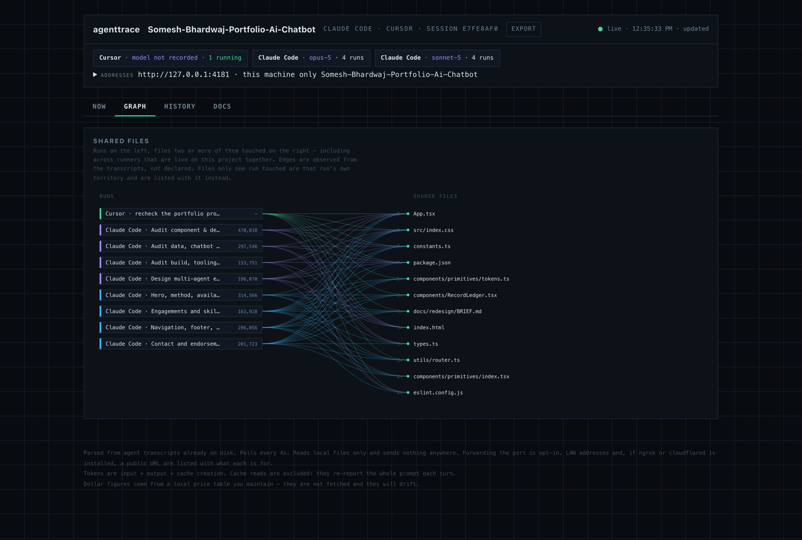
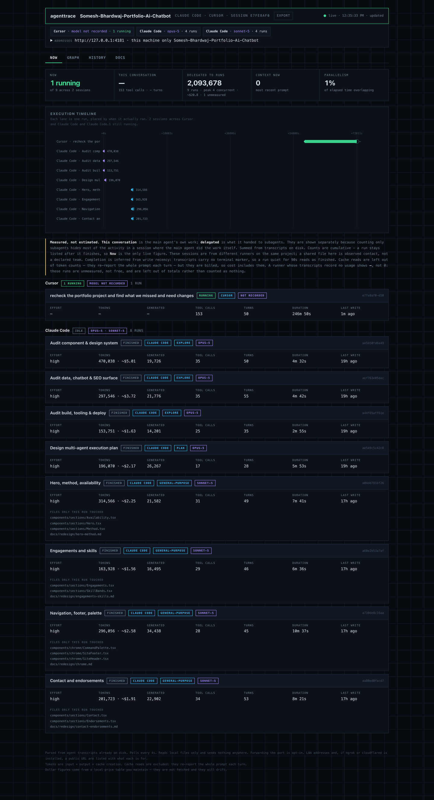
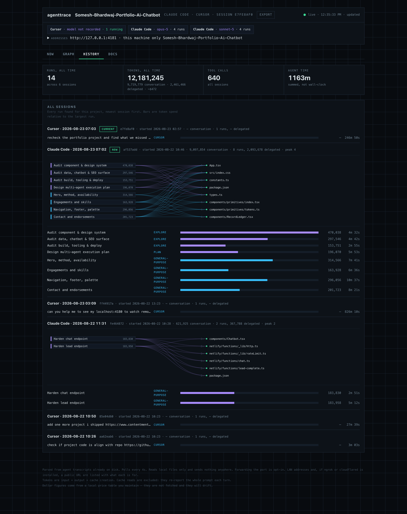
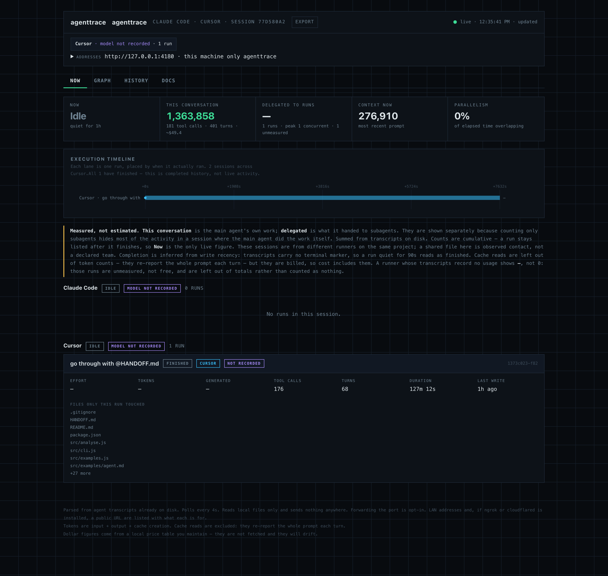

# agenttrace


[](https://github.com/Dev-Somesh/agenttrace/actions/workflows/ci.yml)

> Published as **`@dev-somesh/agenttrace`**. Unrelated projects publish under
> `@agenttrace/*` and `agent-trace`; both sit in the request path and require
> you to have started the run through them. This one reads transcripts the
> runner already wrote, so it works on runs that have already finished.


**See what your coding agents actually did.**

Run several agents in parallel and you lose sight of them. Which one burned the
tokens? Did they genuinely run concurrently, or just start together? Did two of
them quietly edit the same file?

`agenttrace` answers that from the transcripts your agent runner already writes
to disk. No instrumentation, no wrapper, no account.

```bash
npx @dev-somesh/agenttrace
```

Opens a local console at `http://127.0.0.1:4180` for the project you ran it in.
The page names that project and lists every runner and model that has a session
on it — two tools in two chats, both shown.



*Runs on the left, files two or more of them touched on the right. Every edge
was observed in a transcript — a run appears against a file because it opened
it, not because its instructions said it would.*

---

## What it shows

**Now** — every live session on this project, across runners and models, not
just the newest chat. For each: the session id, what the **main conversation**
itself spent, what it **delegated** to subagents, live context size, tool
calls, and a **parallelism figure** — the share of elapsed time with more than
one run active. Launching four agents
together does not mean they overlapped; this says whether they did.

**Execution timeline** — one lane per run, placed by when it actually ran.
Overlapping bars are real concurrency.

**Shared files** — a bipartite graph linking runs to the files two or more of
them touched. The edges are **observed from the transcripts**, not read from
prompts. A run appears against a file because it opened it, which is a different
claim from "its instructions said it would".

**History** — every session found for the project, with per-session graphs, so
you can see what a run cost weeks later.

**Docs** — plans, skills, agents, commands and rules the runner keeps beside
*this* project, rendered in place. Files from a home-directory pile (other
repos) are not shown. If the project has none, the tab lists short samples so
you can see what it is for. `--docs plans,skills` narrows it.

## Why the numbers are what they are

**Main-session work is counted separately from subagent runs.** Counting only
subagents hides most of the activity in a session where the main agent did the
work itself; summing them hides the split. Both are shown.

**Cache reads are excluded from token totals, but included in cost.** They
re-report the entire prompt on every turn, so summing them across a session
counts the same context dozens of times — the token headline is
`input + output + cache_creation`. They are still billed, at about a tenth of
the input rate on far more tokens, so leaving them out of the dollar figure
understated real spend. Cache writes are billed above the input rate, not at
it. The four classes are priced separately; the headline is unchanged.

**Agent time is summed per run**, so it exceeds wall-clock wherever runs
overlapped. The UI says so rather than implying elapsed duration.

**Dollar figures come from a local price table**, not a live feed. Put the
rates you actually pay in an `agenttrace.json` beside your project:

```json
{ "prices": { "claude-opus-5": { "input": 2, "output": 9 } } }
```

Anything you list replaces the shipped rate; anything you leave out keeps it,
and a model the table has never heard of can be added the same way. A config
that cannot be read is reported on the page rather than ignored. (Editing
`src/prices.js` works too, but under `npx` that file lives in a cache and your
edit is gone on the next run.) Every current model needs its own entry:
matching is by longest prefix, so a generic family entry will quietly price a
newer model at an older model's rate. An unlisted model shows no cost rather
than an invented one.

**Completion is inferred, not asserted.** Transcripts carry no terminal marker,
so a run quiet for 90 seconds reads as finished. The interface states this.

**Interconnection is per session.** Two runs months apart both reading a shared
config were not collaborating. Within one session, touching the same file means
working the same ground.

## The console

Four tabs. These are real sessions on a real project — two runners, six
sessions, fourteen runs.

**Now** — what the current conversation spent, what it delegated, and whether
the runs actually overlapped.



**History** — every session found for the project, newest write first, each
with its own runs and shared-file graph.



**Docs** — plans, skills, agents, commands and rules the runner keeps beside
this project, rendered in place.


### On a project with almost nothing to show

Pointed at a repo with one Cursor run and no subagents, the console says so
rather than inventing activity. Cursor records no token usage, so those figures
read `—`, not `0` — unmeasured, not free.



<details>
<summary>The other tabs on that same sparse project</summary>

A graph with nothing shared, a history of one session, and a Docs tab falling
back to shipped samples because the project keeps none of its own. Each says
what it found rather than rendering blank.


</details>

## Privacy

Everything is read from local files and rendered locally. **agenttrace makes no
network requests and transmits nothing.** There is no telemetry and no account.

Transcripts can contain prompts, file paths, and anything typed into a shell —
including secrets. Treat the console as you would the transcripts themselves.

The default bind is **localhost**. Forwarding the port (the button on the page,
`--lan`, or `--tunnel`) is opt-in and lists every address with what it is for:
this machine, Wi-Fi, VPN, and — if `ngrok` or `cloudflared` is already on your
PATH — a public internet URL. Anyone who can open a live URL can read the
transcripts and can stop sharing or stop the console from the same page.
agenttrace does not bundle a tunnel client and does not start one unless you
ask.

## Usage

```bash
npx @dev-somesh/agenttrace                 # console for the current directory
npx @dev-somesh/agenttrace --port 5000     # different port
npx @dev-somesh/agenttrace --dir <path>    # another project
npx @dev-somesh/agenttrace --json          # print the data and exit
npx @dev-somesh/agenttrace --sources       # list detected agent runners
npx @dev-somesh/agenttrace --docs plans    # show only these document collections
npx @dev-somesh/agenttrace --since 24h     # only runs active in this window
npx @dev-somesh/agenttrace --export out.html
                               # self-contained snapshot, shareable in a PR
npx @dev-somesh/agenttrace --lan           # reachable on the same Wi-Fi (opt-in)
npx @dev-somesh/agenttrace --tunnel        # also start ngrok / cloudflared if installed
npx @dev-somesh/agenttrace --detach        # keep serving after the terminal closes
```

`--json` makes it scriptable: pipe it into `jq` for cost reporting, or assert on
it in CI.

## Supported runners

| Runner | Status |
|---|---|
| Claude Code | Supported |
| Cursor | Supported — transcripts do not record token usage, so those figures stay 0 |
| Others | Adapter interface is public — see below |

## Adding a runner

`agenttrace` knows nothing about any specific tool. A **source** discovers runs
and normalises them; everything else works only against those shapes.

To add one, write a file in `src/sources/` implementing the `Source` interface
in `src/sources/types.js` and register it in `src/sources/index.js`. Nothing
outside that directory references a vendor, by design.

A source returns sessions of runs, where a run is:

```js
{ id, name, kind, model, status, tokens, outputTokens,
  toolCalls, turns, startedAt, lastActivityAt, durationMs,
  reads: [...], writes: [...] }
```

If your runner records file operations differently, the only work is mapping
them onto `reads` and `writes`.

## Requirements

Node 18+. No dependencies.

## Licence

MIT © Somesh Bhardwaj
