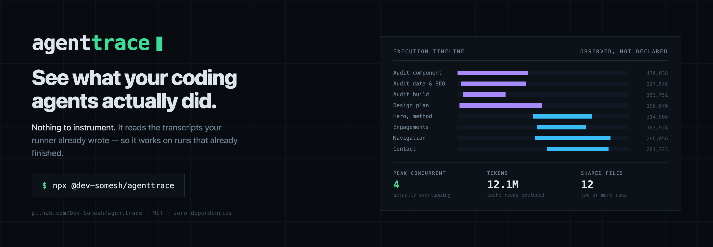
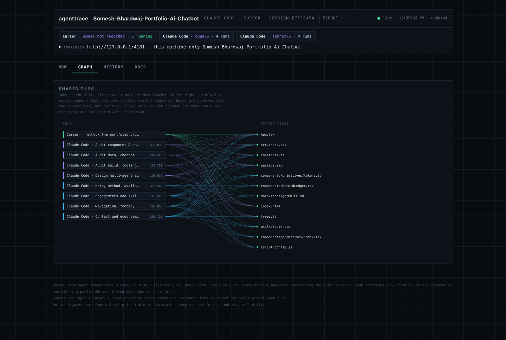
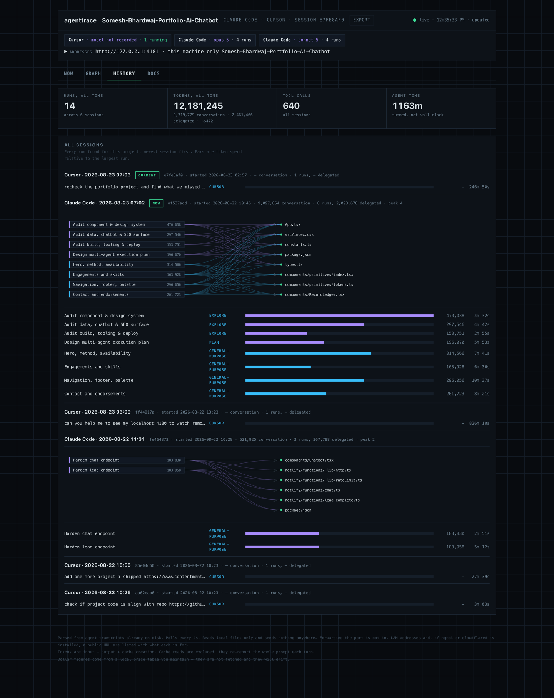
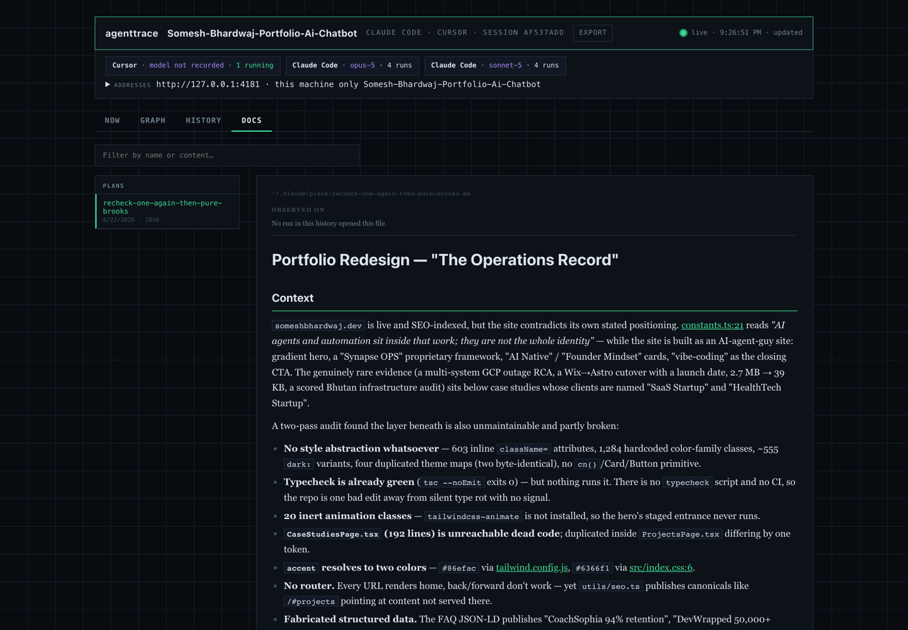
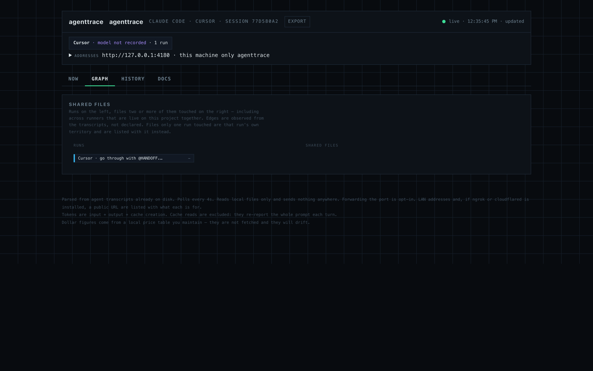
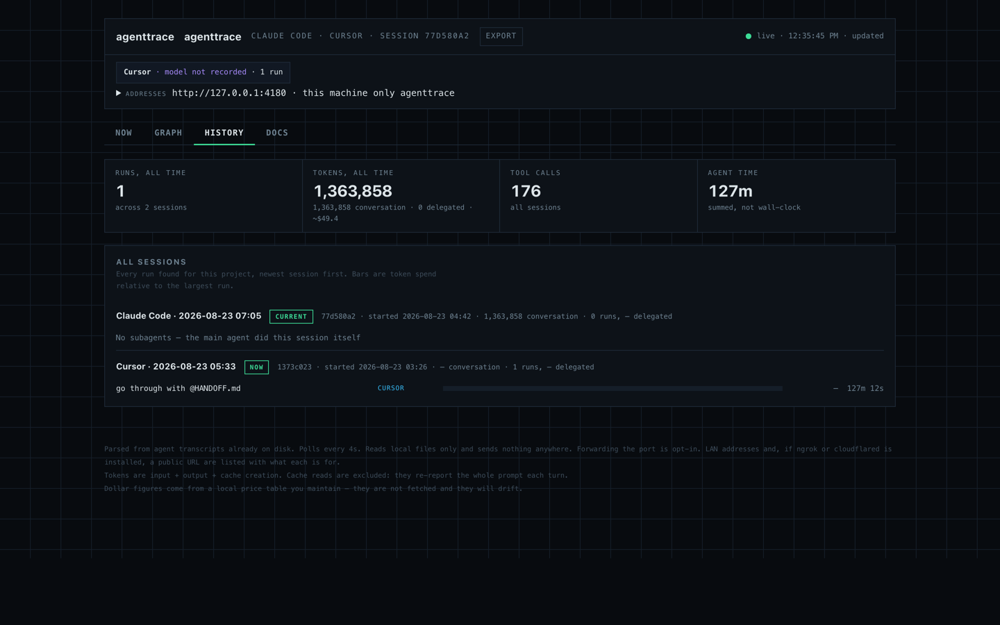
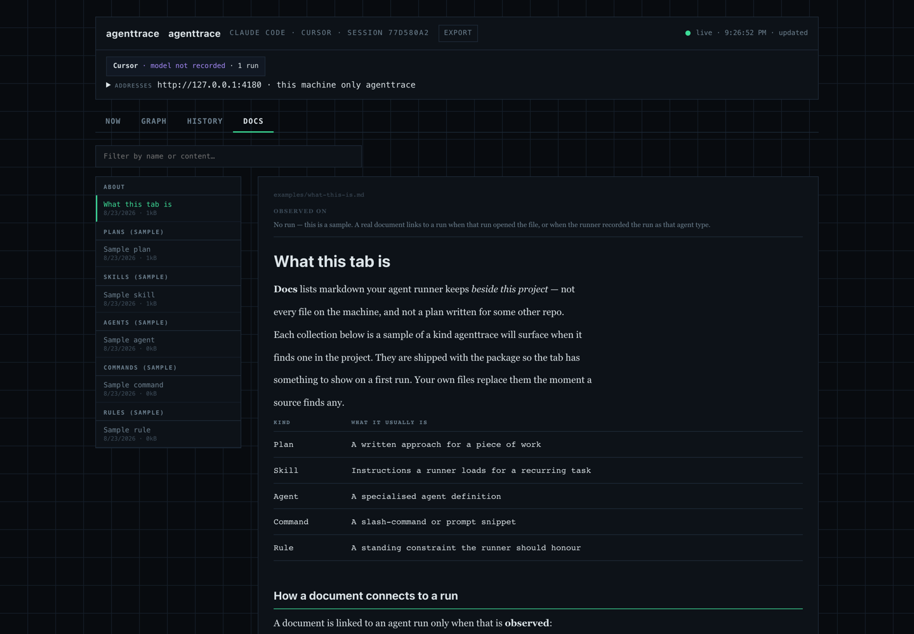

# agenttrace



[](https://github.com/Dev-Somesh/agenttrace/actions/workflows/ci.yml)
[](https://nodejs.org)
[](package.json)
[](LICENSE)

> Published as **`@dev-somesh/agenttrace`**. Unrelated projects publish under
> `@agenttrace/*` and `agent-trace`; both sit in the request path and require
> you to have started the run through them. This one reads transcripts the
> runner already wrote, so it works on runs that have already finished.


**See what your coding agents actually did.**

Run several agents in parallel and you lose sight of them. Which one burned the
tokens? Did they genuinely run concurrently, or just start together? Did two of
them quietly edit the same file?

`agenttrace` answers that from the transcripts your agent runner already writes
to disk. No instrumentation, no wrapper, no account.

```bash
npx @dev-somesh/agenttrace
```

Opens a local console at `http://127.0.0.1:4180` for the project you ran it in.
The page names that project and lists every runner and model that has a session
on it — two tools in two chats, both shown.



*Runs on the left, files two or more of them touched on the right. Every edge
was observed in a transcript — a run appears against a file because it opened
it, not because its instructions said it would.*

---

## Setup

**Requirements.** Node 18 or newer. There are no dependencies, so there is
nothing else to install.

You also need a supported agent runner that has already written transcripts for
the project you point at — agenttrace reads what is on disk, it does not create
it. `--sources` tells you what it found on your machine.

**Run it without installing**

```bash
cd your-project
npx @dev-somesh/agenttrace
```

**Install it**

```bash
npm install -g @dev-somesh/agenttrace
agenttrace                     # from any project directory
```

**Run it from a clone**

```bash
git clone https://github.com/Dev-Somesh/agenttrace.git
cd agenttrace
node src/cli.js --dir /path/to/your-project
```

No `npm install` step: the repository is the program.

## What it shows

**Now** — every live session on this project, across runners and models, not
just the newest chat. For each: the session id, what the **main conversation**
itself spent, what it **delegated** to subagents, live context size, tool
calls, and a **parallelism figure** — the share of elapsed time with more than
one run active. Launching four agents
together does not mean they overlapped; this says whether they did.

**Execution timeline** — one lane per run, placed by when it actually ran.
Overlapping bars are real concurrency.

**Shared files** — a bipartite graph linking runs to the files two or more of
them touched. The edges are **observed from the transcripts**, not read from
prompts. A run appears against a file because it opened it, which is a different
claim from "its instructions said it would".

**History** — every session found for the project, with per-session graphs, so
you can see what a run cost weeks later.

**Docs** — plans, skills, agents, commands and rules the runner keeps beside
*this* project, rendered in place. Files from a home-directory pile (other
repos) are not shown. If the project has none, the tab lists short samples so
you can see what it is for. `--docs plans,skills` narrows it.

## Why the numbers are what they are

**Main-session work is counted separately from subagent runs.** Counting only
subagents hides most of the activity in a session where the main agent did the
work itself; summing them hides the split. Both are shown.

**Cache reads are excluded from token totals, but included in cost.** They
re-report the entire prompt on every turn, so summing them across a session
counts the same context dozens of times — the token headline is
`input + output + cache_creation`. They are still billed, at about a tenth of
the input rate on far more tokens, so leaving them out of the dollar figure
understated real spend. Cache writes are billed above the input rate, not at
it. The four classes are priced separately; the headline is unchanged.

**Agent time is summed per run**, so it exceeds wall-clock wherever runs
overlapped. The UI says so rather than implying elapsed duration.

**Dollar figures come from a local price table**, not a live feed. Put the
rates you actually pay in an `agenttrace.json` beside your project:

```json
{ "prices": { "claude-opus-5": { "input": 2, "output": 9 } } }
```

Anything you list replaces the shipped rate; anything you leave out keeps it,
and a model the table has never heard of can be added the same way. A config
that cannot be read is reported on the page rather than ignored. (Editing
`src/prices.js` works too, but under `npx` that file lives in a cache and your
edit is gone on the next run.) Every current model needs its own entry:
matching is by longest prefix, so a generic family entry will quietly price a
newer model at an older model's rate. An unlisted model shows no cost rather
than an invented one.

**Completion is inferred, not asserted.** Transcripts carry no terminal marker,
so a run quiet for 90 seconds reads as finished. The interface states this.

**Interconnection is per session.** Two runs months apart both reading a shared
config were not collaborating. Within one session, touching the same file means
working the same ground.

## The console

Four tabs. These are real sessions on a working project — two runners, six
sessions, fourteen runs, captured from an actual day's work.

**Now** — what the current conversation spent, what it delegated, and whether
the runs actually overlapped.


**History** — every session found for the project, newest write first, each
with its own runs and shared-file graph.



**Docs** — plans, skills, agents, commands and rules the runner keeps beside
this project, rendered in place.



### On a project with almost nothing to show

Pointed at a repository with a single run and no subagents, the console says so
rather than inventing activity. Cursor records no token usage, so those figures
read `—`, not `0` — unmeasured, not free.


<details>
<summary>The other tabs on that same sparse project</summary>

A graph with nothing shared, a history of one session, and a Docs tab falling
back to shipped samples because the project keeps none of its own. Each says
what it found rather than rendering blank.







</details>

## If a coding agent is setting this up

Point your agent at this section. It is written to be followed literally.

**Copy-paste this to your agent:**

> Set up agenttrace for this project and open the dashboard. Follow the
> instructions in the "If a coding agent is setting this up" section of
> https://github.com/Dev-Somesh/agenttrace

### Instructions for the agent

You are setting up a read-only local dashboard. It needs no API key, no
account, and no configuration. Do not modify the user's project.

**1. Check the runtime.** `node --version` must be 18 or newer. Do not run
`npm install` — this package has no dependencies and the repository is the
program.

**2. Start it in the background.** The server runs until stopped, so a
foreground call will block you until you time out. Use `--detach`, which spawns
the server, prints the URL and pid, and returns immediately:

```bash
cd /path/to/the/users/project
npx -y @dev-somesh/agenttrace --detach
```

Expected output, with the pid varying:

```
agenttrace running in background (pid 13988)
  project   your-project
  this machine only      http://127.0.0.1:4180
  Stop from the page or: kill 13988
```

**3. Confirm it is serving** before telling the user it is ready:

```bash
curl -s http://127.0.0.1:4180/api/state | head -c 200
```

**4. Open the dashboard on the user's machine.**

```bash
open http://127.0.0.1:4180        # macOS
xdg-open http://127.0.0.1:4180    # Linux
start http://127.0.0.1:4180       # Windows
```

If you cannot open a browser — you are on a remote host, in a container, or
have no display — say so and give the user the URL to open themselves. Do not
use `--lan` or `--tunnel` to work around it; see the constraint below.

**5. Report what it found.** `--sources` lists the runners detected. If it
prints nothing, the machine has no supported agent transcripts and the
dashboard will be empty — that is not a failure to debug, it is the honest
answer. Tell the user rather than trying to generate data.

### Handling the common failures

| What you see | What it means | What to do |
|---|---|---|
| `listen EADDRINUSE: ... 127.0.0.1:4180` | Something already holds the port. There is no automatic fallback. | Retry with `--port 4181`, or check whether an agenttrace is already running and just open it. |
| Dashboard loads but every panel is empty | No transcripts for this directory | Run `--sources`. Confirm the user has run a supported agent **in this project**. |
| Tokens show `—` rather than a number | That runner records no usage | Correct behaviour, not a bug. `—` means unmeasured; `0` would mean free. |
| A red "running old code" banner | The server started before the files changed | Restart the process. Reloading the page will not help. |

### Constraints — do not violate these

- **Never pass `--lan` or `--tunnel` unless the user explicitly asks.** They
  expose the console beyond the machine. Transcripts contain prompts, file
  paths, and sometimes secrets typed into a shell.
- **Never commit anything you create here.** If you add an `agenttrace.json`
  for prices, tell the user it exists.
- **Do not paste dashboard contents into a public issue or PR** without asking.
  The `--export` snapshot deliberately strips documents for this reason.

### If you cannot open a browser at all

Skip the server. `--json` prints everything and exits, which is also how to
assert on cost in CI:

```bash
npx -y @dev-somesh/agenttrace --json --since 24h
```

## Privacy

Everything is read from local files and rendered locally. **agenttrace makes no
network requests and transmits nothing.** There is no telemetry and no account.

Transcripts can contain prompts, file paths, and anything typed into a shell —
including secrets. Treat the console as you would the transcripts themselves.

The default bind is **localhost**. Forwarding the port (the button on the page,
`--lan`, or `--tunnel`) is opt-in and lists every address with what it is for:
this machine, Wi-Fi, VPN, and — if `ngrok` or `cloudflared` is already on your
PATH — a public internet URL. Anyone who can open a live URL can read the
transcripts and can stop sharing or stop the console from the same page.
agenttrace does not bundle a tunnel client and does not start one unless you
ask.

## Usage

```bash
npx @dev-somesh/agenttrace                 # console for the current directory
npx @dev-somesh/agenttrace --port 5000     # different port
npx @dev-somesh/agenttrace --dir <path>    # another project
npx @dev-somesh/agenttrace --json          # print the data and exit
npx @dev-somesh/agenttrace --sources       # list detected agent runners
npx @dev-somesh/agenttrace --docs plans    # show only these document collections
npx @dev-somesh/agenttrace --since 24h     # only runs active in this window
npx @dev-somesh/agenttrace --export out.html
                               # self-contained snapshot, shareable in a PR
npx @dev-somesh/agenttrace --lan           # reachable on the same Wi-Fi (opt-in)
npx @dev-somesh/agenttrace --tunnel        # also start ngrok / cloudflared if installed
npx @dev-somesh/agenttrace --detach        # keep serving after the terminal closes
```

`--json` makes it scriptable: pipe it into `jq` for cost reporting, or assert on
it in CI.

## Configuration

Everything is optional. agenttrace runs with no config at all.

**Prices.** Put the rates you actually pay in an `agenttrace.json` beside your
project:

```json
{
  "prices": {
    "claude-opus-5": { "input": 5, "output": 25 },
    "your-private-deployment": { "input": 0, "output": 0 }
  }
}
```

Listed models replace the shipped rate, unlisted ones keep it, and a model the
table has never heard of can be added the same way. A config that cannot be
parsed is reported on the page rather than ignored. Figures are USD per million
tokens.

**Which documents to show.** `--docs plans,skills` narrows the Docs tab to those
collections.

**How far back to look.** `--since 24h` limits every figure to runs active in
that window, which is what makes `--json` useful as a CI budget assertion.

## Supported runners

| Runner | Status |
|---|---|
| Claude Code | Supported |
| Cursor | Supported — transcripts do not record token usage, so those figures stay 0 |
| Others | Adapter interface is public — see below |

## Adding a runner

`agenttrace` knows nothing about any specific tool. A **source** discovers runs
and normalises them; everything else works only against those shapes.

To add one, write a file in `src/sources/` implementing the `Source` interface
in `src/sources/types.js` and register it in `src/sources/index.js`. Nothing
outside that directory references a vendor, by design.

A source returns sessions of runs, where a run is:

```js
{ id, name, kind, model, status, tokens, outputTokens,
  toolCalls, turns, startedAt, lastActivityAt, durationMs,
  reads: [...], writes: [...] }
```

If your runner records file operations differently, the only work is mapping
them onto `reads` and `writes`.

## Contributing

[CONTRIBUTING.md](CONTRIBUTING.md) covers the architecture, how to add a runner,
and the decisions behind the parts of this codebase that look odd on purpose —
why cache reads are excluded from token counts but included in cost, why an
unlisted model reports no price rather than a guessed one, and why the adapter
boundary is enforced by CI.

## Author

Somesh Bhardwaj — [someshbhardwaj.dev](https://someshbhardwaj.dev) ·
[LinkedIn](https://www.linkedin.com/in/ersomeshbhardwaj/) ·
[GitHub](https://github.com/Dev-Somesh)

## Licence

MIT © [Somesh Bhardwaj](https://someshbhardwaj.dev)
